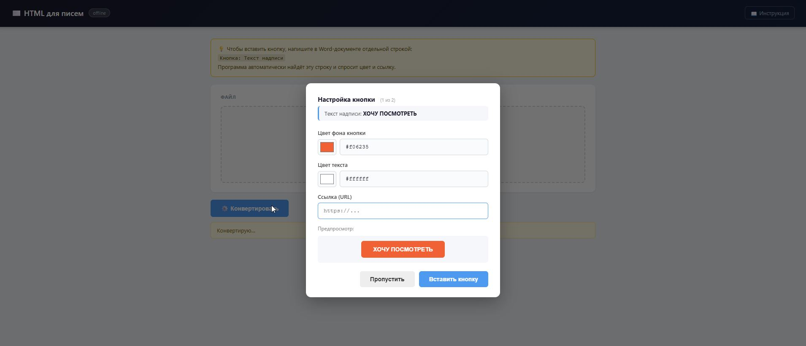
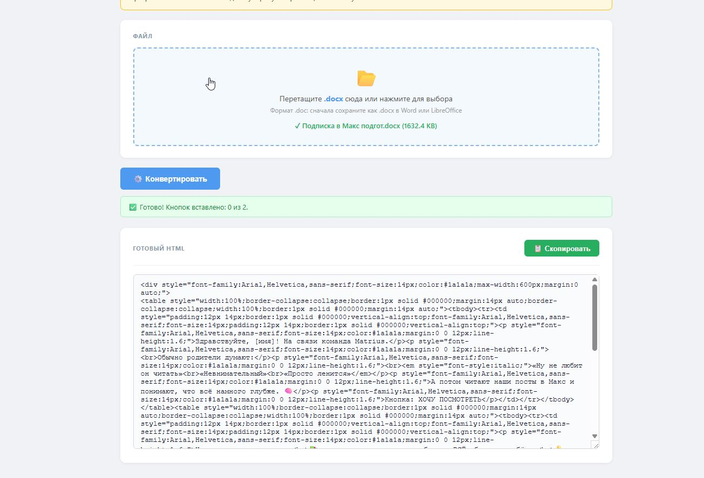

# HTML для писем

Маленький офлайн-инструмент: конвертирует `.docx` Word-документ в готовый HTML для вставки в email-рассылки. Совместим с Unisender, Gmail, GetCourse, Mailchimp и другими платформами.

## Что внутри

```
html-email-generator/
├── html_generator.html    ← главный файл, открывается в браузере
├── инструкция.html        ← подробная инструкция
├── mammoth.browser.min.js ← библиотека для парсинга .docx (нужна, не удалять)
├── assets/                ← скриншоты
│   ├── button-modal.jpg
│   └── result-html.jpg
└── README.md              ← этот файл
```

## Как запустить

1. Распакуй архив (если получил архив) или скопируй папку целиком на компьютер.
2. Двойной клик по `html_generator.html` — откроется в браузере по умолчанию (Chrome, Firefox, Edge — все подходят).
3. Перетащи `.docx`-файл в зону загрузки, нажми «⚙️ Конвертировать».
4. Скопируй готовый HTML кнопкой «📋 Скопировать» и вставь в платформу рассылки.

Подробности и FAQ — в файле `инструкция.html` (есть ссылка в шапке самого генератора).

## Скриншоты

<p align="center">
  
  <br><em>Модалка настройки кнопки — цвет фона, текста, ссылка</em>
</p>

<p align="center">
  
  <br><em>Результат конвертации — готовый HTML для вставки в рассылку</em>
</p>

## Что умеет

- Заголовки H1–H4, абзацы, таблицы с рамками, нумерованные и маркированные списки.
- Жирный, курсив, подчёркивание, зачёркивание, ссылки.
- Изображения из документа встраиваются как base64.
- Кнопки: строка `Кнопка: Текст надписи` в Word превращается в кликабельную кнопку с настройкой цвета и URL.
- Все стили инлайн — корректно отображается даже в Gmail, который вырезает внешние CSS.
- Ширина письма — 600px, шрифт Arial (стандарт совместимости для email).

## Технические требования

- Любой современный браузер (Chrome, Firefox, Edge, Safari).
- Интернет НЕ нужен — работает офлайн полностью локально.
- Никакие данные не отправляются на сервера. Всё происходит в твоём браузере.

## Если что-то не работает

- **Браузер ругается на mammoth** — проверь, что файл `mammoth.browser.min.js` лежит в той же папке.
- **Формат `.doc`** — браузер его не читает. Открой документ в Word или LibreOffice и пересохрани как `.docx`.
- **Большие документы с картинками** — итоговый HTML может оказаться большим (base64 раздувает размер). Если рассылка ограничивает размер — пересохрани картинки в Word с меньшим разрешением.

## Передано

Версия от 29 мая 2026. Готова к самостоятельному использованию — никаких настроек, аккаунтов и установок не требуется.
